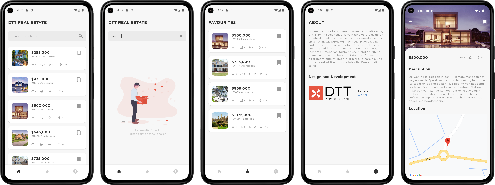

# DTT Real Estate
DTT Real Estate application fetches data from a remote source, using the company API, and displays it as houses.

The log hours can be found in the assets directory.

The application was implemented using the MVVM pattern, Retrofit2, Room, LiveData, ViewModel, Coroutines, Navigation Components, Data Binding, Kotlin serialization, Coil, and Google play services for maps.



## Installation
DTT Real Estate requires a minimum API level of 21. 

API keys are needed for obtaining the houses and for using Google map service.

In the project's root directory, inside the `local.properties` file, include two API keys with the following property names:

````properties
DTT_ACCESS_KEY = "YOUR_API_KEY"
GOOGLE_MAP_API_KEY = "YOUR_API_KEY"
````
